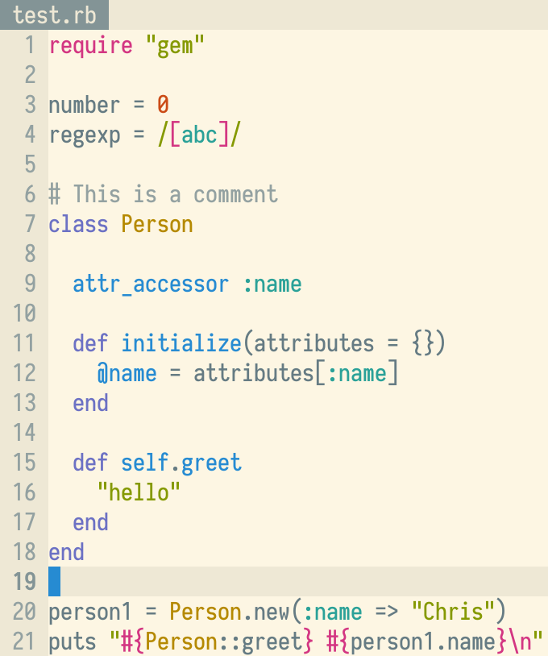

# Base16 Solarized Scheme

A more accurate [Solarized][] color scheme for [Base16][].

|       | This repository                 | [arzg/base16-solarized-scheme][arzg] |
| ----- | ------------------------------- | ------------------------------------ |
| Dark  |   |        |
| Light |  |       |
 
## Usage

To build templates using this scheme instead of the [official one][arzg]:

```
pip3 install pybase16-builder
cd some/empty/directory
pybase16 update
rm -rf schemes/solarized
git clone https://github.com/mk12/base16-solarized-scheme schemes/solarized
# Build all templates and schemes:
pybase16 build
# Build just solarized:
pybase16 build -s 'solarized-*'
```

Since I only use Base16 for [kitty][], I use a [custom build setup][b16kitty] that makes the process much easier.

## Rationale

The official "solarized" scheme [arzg/base16-solarized-scheme][arzg] does not faithfully represent Ethan Schoonover's theme. For example, the website [clearly shows][usage] the dark theme using base0 (`#839496`) for body text, but arzg's repository uses base1 (`#93a1a1`). This repository fixes this and other issues.

It's very easy to get confused because both Base16 and Solarized use 16 colors with similar names:

- Base16 uses eight monotones (base00 through base07) and eight accents (base08 through base0F).

- Solarized uses eight monotones (base03, base02, base01, base00, base0, base1, base2, base3) and eight acccents (yellow, orange, red, magenta, violet, blue, cyan, green).

> **Note**: In the following, I use "emphasized" to mean brighter in dark themes, darker in light themes; and "de-emphasized" to mean the opposite.

Here are the eight Solarized monotones and their [intended uses][usage]:

| Base | Dark                  | Light                 |
| ---: | --------------------- | --------------------- |
|   03 | background            | inverse background    |
|   02 | emphasized background |                       |
|   01 | comments              | emphasized text       |
|   00 |                       | text                  |
|    0 | text                  |                       |
|    1 | emphasized text       | comments              |
|    2 |                       | emphasized background |
|    3 | inverse background    | background            |

And here are the eight Base16 monotones and their [intended uses][styling]:

| Base | Meaning               |
| ---: | --------------------- |
|   00 | background            |
|   01 | emphasized background |
|   02 | selection background  |
|   03 | comments              |
|   04 | de-emphasized text    |
|   05 | text                  |
|   06 | emphasized text       |
|   07 | inverse background    |

In [arzg/base16-solarized-scheme][arzg], the monotones are mapped like this:

| Base16 | Base16 meaning        | Sol. Dark | Sol. Light | Solarized meaning     |
| -----: | --------------------- | --------: | ---------: | --------------------- |
|     00 | background            |        03 |          3 | background            |
|     01 | emphasized background |        02 |          2 | emphasized background |
|     02 | selection background  |        01 |          1 | comments              |
|     03 | comments              |        00 |          0 |                       |
|     04 | de-emphasized text    |         0 |         00 | text                  |
|     05 | text                  |         1 |         01 | emphasized text       |
|     06 | emphasized text       |         2 |         02 |                       |
|     07 | inverse background    |         3 |         03 | inverse background    |

While this is a nice one-to-one mapping, it has problems. The color it uses for regular text is actually intended by Solarized for emphasized text; and for emphasized text, it uses a harsh shade not intended for text at all. This mapping effectively increases the theme's contrast.

This repository instead maps the monotones like this:

| Base16 | Base16 meaning        | Sol. Dark | Sol. Light | Solarized meaning     |
| -----: | --------------------- | --------: | ---------: | --------------------- |
|     00 | background            |        03 |          3 | background            |
|     01 | emphasized background |        02 |          2 | emphasized background |
|     02 | selection background  |   #33515b |    #c0c4bb |                       |
|     03 | comments              |        01 |          1 | comments              |
|     04 | de-emphasized text    |        00 |          0 |                       |
|     05 | text                  |         0 |         00 | text                  |
|     06 | emphasized text       |         1 |         01 | emphasized text       |
|     07 | inverse background    |         3 |         03 | inverse background    |

This accurately matches up the monotones by their intended meaning in each framework, at the cost of inventing extra colors for "selection background". This is necessary because Solarize lacks a shade in between "emphasized background" and "comments". I chose these new colors by linearly interpolating 50% between 02/2 and 01/1 in [CIELAB][]:

| Solarized |      L\*a\*b       |     Hex     |
| --------: | :----------------: | :---------: |
|        02 |     20 -12 -12     |   #073642   |
|           | **32.5 -9.5 -9.5** | **#33515b** |
|        01 |      45 -7 -7      |   #586e75   |
|         1 |      65 -5 -2      |   #93a1a1   |
|           |  **78.5 -2.5 4**   | **#c0c4bb** |
|         2 |     92  0  10      |   #eee8d5   |

[Solarized]: https://ethanschoonover.com/solarized/
[usage]: https://ethanschoonover.com/solarized#usage-development
[Base16]: https://github.com/chriskempson/base16
[styling]: https://github.com/chriskempson/base16/blob/master/styling.md
[arzg]: https://github.com/arzg/base16-solarized-scheme
[kitty]: https://sw.kovidgoyal.net/kitty
[b16kitty]: https://github.com/mk12/base16-kitty/
[CIELAB]: https://en.wikipedia.org/wiki/CIELAB_color_space
